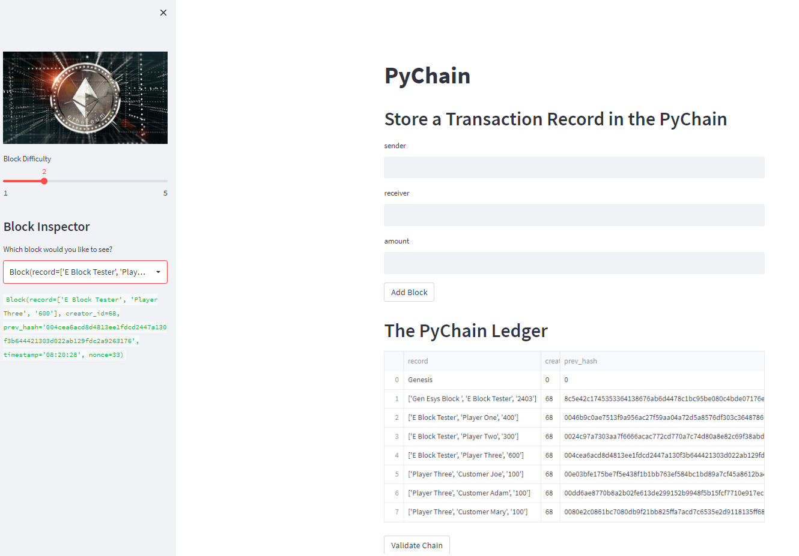

# Streamlit-Blockchain
A Streamlit UI enabling users to enter data and store it in a blockchain. 
### libraries and dependancies
import pandas as pd
from typing import Any, List
import datetime as datetime
import streamlit as st # pip install streamlit
from dataclasses import dataclass
import hashlib
* From within the directory where this code resides, open Streamlit using `streamlit run pychain.py`.

## Synopsis
This project runs a cached version of Streamlit. It will hold the data information for as long as the project remains open in the browser.
### In the main panel:
* There are user inputs for sender, reciever and amount of 'Eth' sent. 
* Input fields can be retained to modify for next transaction or cleared for new inputs
* Each transaction records onto a block of the blockchain.
* Block data such as input data record, timestamp, previous hash and nonce value are recorded and displayed.
The validity of block transactions can be verified at a click.

### On the side panel: 
* There is a slider to adjust the difficulty of the 'Proof of work' requirements
* A drop down selector to choose individual blocks and inspect their contents

